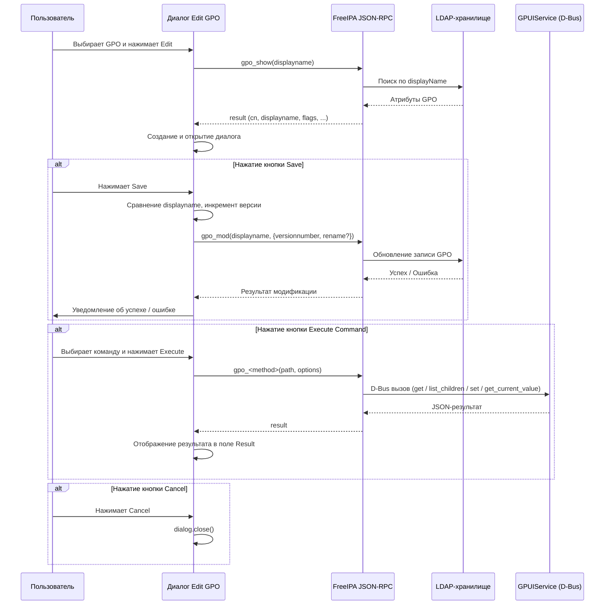
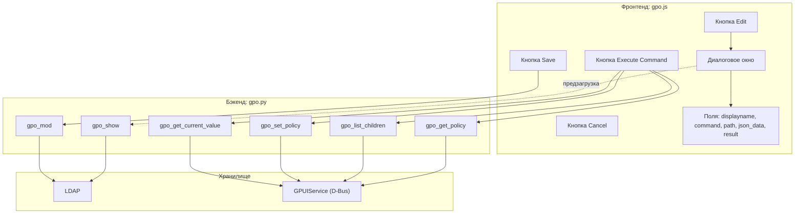

# Диалоговое окно редактирования Group Policy Object (GPO)

## Содержание

1. [Общее описание и способ вызова](#1-общее-описание-и-способ-вызова)
2. [Фаза загрузки данных](#2-фаза-загрузки-данных)
3. [Поля диалога](#3-поля-диалога)
4. [Динамическая видимость поля JSON Data](#4-динамическая-видимость-поля-json-data)
5. [Кнопки диалога](#5-кнопки-диалога)
6. [Команды бэкенд API](#6-команды-бэкенд-api)
7. [Обработка ошибок](#7-обработка-ошибок)
8. [Диаграмма потока данных](#8-диаграмма-потока-данных)

---

## 1. Общее описание и способ вызова

Диалоговое окно редактирования GPO — это модальное всплывающее окно в веб-интерфейсе FreeIPA, предназначенное для просмотра и изменения объекта групповой политики (Group Policy Object). Диалог совмещает две функции: редактирование метаданных GPO (имя, версия) и интерактивное выполнение команд над структурой политик GPO через GPUIService.

### Как вызвать диалог

1. Перейти в раздел **Policy → Group Policy Objects** в веб-интерфейсе FreeIPA.
2. В таблице со списком GPO выбрать **ровно одну** политику, установив чекбокс в соответствующей строке.
3. Нажать кнопку **Edit** (иконка карандаша `fa-pencil`) на панели управления над таблицей.

Кнопка **Edit** активна только при выполнении условия `item-selected` — то есть когда выбран хотя бы один элемент. Если выбрано более одного GPO, диалог не откроется и будет показано сообщение об ошибке: *«Please select exactly one GPO to edit»*.

### Исходный код

Действие определено в функции `exp.edit_action` в файле `plugin/ui/grouppolicy/gpo.js` (строки 105–361). Действие регистрируется в системе FreeIPA под именем `'edit'` через `reg.action.register('edit', exp.edit_action)`.

---

## 2. Фаза загрузки данных

Перед открытием диалога выполняется предварительная загрузка текущих данных выбранного GPO. Это необходимо для заполнения полей диалога актуальными значениями.

### Последовательность действий

1. Из фасета (facet) поиска извлекается имя выбранного GPO через `facet.get_selected_values()`.
2. Выполняется RPC-вызов `gpo_show` с передачей имени GPO в качестве аргумента.
3. На стороне сервера команда `gpo_show` (класс `LDAPRetrieve` в `plugin/ipaserver/plugins/gpo.py`):
   - Проверяет наличие схемы групповых политик в LDAP (`verify_gpo_schema`).
   - Ищет GPO по атрибуту `displayName` в контейнере `cn=Policies,cn=System,<basedn>`.
   - Возвращает атрибуты: `cn`, `displayName`, `distinguishedName`, `flags`, `gPCFileSysPath`, `versionNumber`.
4. При успешном ответе создаётся и открывается диалоговое окно.
5. При ошибке отображается уведомление *«Failed to load GPO data»* с деталями ошибки.

### Структура ответа

```
data.result.result = {
    cn: "{GUID}",
    displayname: "Имя политики",
    distinguishedname: "cn={GUID},cn=Policies,cn=System,dc=...",
    flags: 0,
    gpcfilesyspath: "\\\\domain\\SysVol\\domain\\Policies\\{GUID}",
    versionnumber: 5
}
```

---

## 3. Поля диалога

Диалоговое окно имеет заголовок вида **«Edit Group Policy Object: <имя_GPO>»** и ширину **600 пикселей**. Содержит пять полей, расположенных вертикально:

### 3.1. Policy Name (displayname)

| Параметр        | Значение                         |
|-----------------|----------------------------------|
| Тип виджета     | `text` (текстовое поле)          |
| Имя поля        | `displayname`                    |
| Метка           | Policy Name                      |
| Обязательное    | Да (`required: true`)            |
| Ширина          | 100%                             |
| Значение по умолчанию | Текущее значение `displayName` из LDAP |

Основное редактируемое поле. Изменение значения этого поля приведёт к переименованию GPO при нажатии кнопки **Save**. Имя политики должно соответствовать паттерну `PATTERN_GROUPUSER_NAME`, определённому в FreeIPA.

### 3.2. Command (command)

| Параметр        | Значение                         |
|-----------------|----------------------------------|
| Тип виджета     | `select` (выпадающий список)     |
| Имя поля        | `command`                        |
| Метка           | Command                          |
| Ширина          | 100%                             |
| Значение по умолчанию | `gpo_get_policy`            |

Выпадающий список для выбора команды, которая будет выполнена при нажатии кнопки **Execute Command**. Доступные варианты:

| Отображаемое имя         | Внутреннее значение         | RPC-метод          | Описание                                           |
|--------------------------|-----------------------------|--------------------|-----------------------------------------------------|
| gpo-get-current-value    | `gpo_get_current_value`     | `get_current_value`| Получить текущее значение из файла политики GPO     |
| gpo-list-children        | `gpo_list_children`         | `list_children`    | Получить список дочерних политик по заданному пути  |
| gpo-set-policy           | `gpo_set_policy`            | `set_policy`       | Установить значение политики в GPO                  |
| gpo-get-policy           | `gpo_get_policy`            | `get_policy`       | Получить значение политики по пути                  |

Выбор команды `gpo_set_policy` динамически отображает скрытое поле **JSON Data** (см. раздел 4).

### 3.3. Path (path)

| Параметр        | Значение                         |
|-----------------|----------------------------------|
| Тип виджета     | `text` (текстовое поле)          |
| Имя поля        | `path`                           |
| Метка           | Path                             |
| Ширина          | 100%                             |
| Значение по умолчанию | `/` (корень структуры GPO)  |

Путь в структуре политик GPO. Используется как аргумент при выполнении команд через кнопку **Execute Command**. Путь `/` обозначает корневой уровень структуры политик, содержащий метаинформацию о категориях и количестве политик.

### 3.4. JSON Data (json_data)

| Параметр        | Значение                                |
|-----------------|-----------------------------------------|
| Тип виджета     | `textarea` (многострочное текстовое поле)|
| Имя поля        | `json_data`                             |
| Метка           | JSON Data (for gpo-set-policy)          |
| Строк           | 5                                       |
| Ширина          | 100%                                    |
| Значение по умолчанию | `{}`                              |
| Скрыто по умолчанию | Да (`hidden: true`)                |

Поле для ввода JSON-данных, передаваемых в команду `gpo_set_policy`. **Отображается только** при выборе команды `gpo_set_policy` в поле Command. Во всех остальных случаях поле скрыто. Значение поля парсится как JSON-объект перед отправкой на сервер; при невалидном JSON отображается ошибка.

### 3.5. Result (result)

| Параметр        | Значение                                |
|-----------------|-----------------------------------------|
| Тип виджета     | `textarea` (многострочное текстовое поле)|
| Имя поля        | `result`                                |
| Метка           | Result                                  |
| Строк           | 15                                      |
| Ширина          | 100%                                    |
| Только чтение   | Да (`read_only: true`)                  |
| Значение по умолчанию | Пустая строка                     |

Область вывода результатов выполнения команд. После нажатия **Execute Command** поле заполняется текстом `«Executing...»`, а затем — JSON-представлением результата команды (отформатированным с отступами в 2 пробела) или сообщением об ошибке.

---

## 4. Динамическая видимость поля JSON Data

Поле **JSON Data** по умолчанию скрыто. Его видимость управляется функцией `updateJsonDataVisibility`, которая вызывается:

- **При инициализации диалога** — сразу после создания виджетов.
- **При изменении значения** в поле Command — через обработчик события `change` на виджете `command`.

### Логика работы

```
Выбранная команда === 'gpo_set_policy'?
├─ Да  → Поле JSON Data ВИДИМО
└─ Нет → Поле JSON Data СКРЫТО
```

Функция определяет переменную `hidden` как `command !== 'gpo_set_policy'` и передаёт противоположное значение `!hidden` в метод `set_visible()` виджета. Обращение к `set_visible` обёрнуто в блок `try/catch` для защиты от ситуаций, когда виджет ещё не полностью инициализирован или DOM-контейнер отсутствует.

---

## 5. Кнопки диалога

Диалог содержит три кнопки, расположенные в нижней части окна. Кнопки создаются динамически через метод `dialog.create_button()`.

### 5.1. Save

| Параметр | Значение |
|----------|----------|
| Имя      | `save`   |
| Метка    | Save     |

Кнопка **Save** сохраняет изменения метаданных GPO. При нажатии выполняется следующая логика:

1. **Извлечение значения** поля `displayname` из виджета диалога.
2. **Проверка переименования**: текущее имя (`result.displayname`) сравнивается с новым значением. Оба значения приводятся к строке и обрезаются (`trim()`). Если имена различаются и новое имя не пустое — в данные модификации добавляется параметр `rename`.
3. **Автоматический инкремент версии**: текущая версия (`result.versionnumber`) увеличивается на 1. Параметр `versionnumber` **всегда** добавляется при нажатии Save, независимо от наличия других изменений.
4. **RPC-вызов `gpo_mod`**: отправляется команда модификации GPO со следующими параметрами:
   - `entity`: `'gpo'`
   - `method`: `'mod'`
   - `args`: `[gpo_name]` (исходное имя GPO)
   - `options`: объект `mod_data` с полями `versionnumber` и опционально `rename`

#### При успешном выполнении:
- Диалог закрывается (`dialog.close()`).
- Таблица GPO обновляется (`facet.refresh()`).
- Отображается уведомление об успехе с информацией о новой версии и, при переименовании, о новом имени.

#### При ошибке:
- Отображается уведомление об ошибке *«Failed to update GPO»* с деталями.

### 5.2. Execute Command

| Параметр | Значение         |
|----------|------------------|
| Имя      | `execute`        |
| Метка    | Execute Command  |

Кнопка **Execute Command** выполняет выбранную команду над структурой политик GPO. При нажатии:

1. **Считываются значения** из полей `command`, `path` и `json_data`.
2. **Формируется имя RPC-метода**: из значения команды удаляется префикс `gpo_` (например, `gpo_get_policy` → `get_policy`).
3. **Подготовка аргументов**: массив `args` содержит `[path]`. Объект `options` содержит `version` (версия API).
4. **Для команды `gpo_set_policy`**: значение поля JSON Data парсится как JSON-объект и добавляется в `options.json`. При невалидном JSON выполнение прерывается с ошибкой.
5. **Поле Result** очищается и заполняется текстом `«Executing...»`.
6. **Выполняется RPC-вызов** к серверу FreeIPA с сущностью `'gpo'` и вычисленным методом.
7. **Результат** отображается в поле Result в формате JSON с отступами (`JSON.stringify(result, null, 2)`).
8. **При ошибке** в поле Result выводится сообщение `«Error: Command failed: <детали>»`.

### 5.3. Cancel

| Параметр | Значение |
|----------|----------|
| Имя      | `cancel` |
| Метка    | Cancel   |

Кнопка **Cancel** закрывает диалоговое окно без сохранения изменений. Вызывает `dialog.close()`.

---

## 6. Команды бэкенд API

Все серверные команды определены в файле `plugin/ipaserver/plugins/gpo.py` и зарегистрированы как команды FreeIPA. Взаимодействие с хранилищем политик осуществляется через D-Bus сервис GPUIService (`org.altlinux.gpuiservice`).

### 6.1. gpo_show (LDAPRetrieve)

Получение информации о GPO из LDAP.

| Параметр     | Описание                                          |
|--------------|---------------------------------------------------|
| Аргументы    | `displayname` — отображаемое имя GPO              |
| Возвращает   | Атрибуты GPO: `cn`, `displayName`, `distinguishedName`, `flags`, `gPCFileSysPath`, `versionNumber` |
| Используется | При открытии диалога (предзагрузка данных)         |

Перед выполнением проверяется наличие схемы GPO в LDAP. Поиск GPO осуществляется по атрибуту `displayName` в контейнере `cn=Policies,cn=System`.

### 6.2. gpo_mod (LDAPUpdate)

Модификация GPO в LDAP.

| Параметр     | Описание                                              |
|--------------|-------------------------------------------------------|
| Аргументы    | `displayname` — текущее имя GPO                       |
| Опции        | `versionnumber` — новый номер версии; `rename` — новое имя (опционально) |
| Используется | При нажатии кнопки Save                                |

Перед выполнением:
- Проверяется схема GPO.
- При переименовании проверяется уникальность нового имени и его соответствие паттерну `PATTERN_GROUPUSER_NAME`.
- При попытке переименовать в то же имя возвращается ошибка валидации.

### 6.3. gpo_get_policy (Command)

Получение значения политики по пути в структуре GPO.

| Параметр     | Описание                                              |
|--------------|-------------------------------------------------------|
| Аргументы    | `path` — путь в структуре политик                     |
| Возвращает   | `result` (dict) — JSON-структура политики; `summary` — текстовое описание |
| D-Bus метод  | `gpuiservice.get(path)`                               |

Формат ответа зависит от пути:
- `/` (корень) — метаинформация: количество категорий, политик, базовая директория, локаль.
- Путь к категории — имя категории, количество прямых политик и унаследованных подкатегорий.
- Путь к конкретной политике — полная структура с `displayName`, заголовком и вложенными данными.

### 6.4. gpo_list_children (Command)

Список дочерних элементов по заданному родительскому пути.

| Параметр     | Описание                                              |
|--------------|-------------------------------------------------------|
| Аргументы    | `parent_path` — родительский путь                     |
| Возвращает   | Список записей `[{name: "..."}, ...]`; `summary` — количество найденных элементов |
| D-Bus метод  | `gpuiservice.list_children(parent_path)`              |

Пустой путь трактуется как корень (`/`). Результат может быть списком (tuple/list) или словарём (dict), оба формата преобразуются в унифицированный список записей.

### 6.5. gpo_set_policy (Command)

Установка значения политики в GPO.

| Параметр     | Описание                                              |
|--------------|-------------------------------------------------------|
| Аргументы    | `name_gpt` — имя GPO (путь относительно sysvol); `target` — тип политики (Machine/User); `path` — путь к политике; `value` — устанавливаемое значение; `metadata` — путь к метаданным ADMX (опционально) |
| Возвращает   | `success` (bool) — результат операции; `summary` — текстовое описание |
| D-Bus метод  | `gpuiservice.set(name_gpt, target, path, value, metadata)` |

### 6.6. gpo_get_current_value (Command)

Получение текущего значения из файла политики GPO.

| Параметр     | Описание                                              |
|--------------|-------------------------------------------------------|
| Аргументы    | `name_gpt` — имя GPO (путь относительно sysvol); `target` — тип политики (Machine/User); `path` — путь к ключу реестра |
| Возвращает   | `result` (dict) — словарь с ключами `value_data` и `value_type`; `summary` — текстовое описание |
| D-Bus метод  | `gpuiservice.get_current_value(name_gpt, target, path)` |

---

## 7. Обработка ошибок

Обработка ошибок реализована на нескольких уровнях.

### 7.1. Уровень UI (диалог)

| Ситуация                              | Реакция                                                        |
|---------------------------------------|----------------------------------------------------------------|
| Выбрано 0 или более 1 GPO            | Уведомление: *«Please select exactly one GPO to edit»*         |
| Не удалось загрузить данные GPO       | Уведомление: *«Failed to load GPO data: <детали>»*             |
| Ошибка при сохранении (`gpo_mod`)     | Уведомление: *«Failed to update GPO: <детали>»*                |
| Невалидный JSON в поле JSON Data      | Уведомление: *«Invalid JSON data: <описание ошибки парсера>»*  |
| Ошибка выполнения команды Execute     | Уведомление + текст ошибки в поле Result                       |
| Ошибка `set_visible` при переключении видимости | Подавляется (пустой блок catch) — защита от race condition |

### 7.2. Уровень бэкенда (серверные команды)

| Ситуация                                         | Реакция                                                          |
|--------------------------------------------------|------------------------------------------------------------------|
| Схема GPO не установлена в LDAP                  | `NotFound`: *«Group Policy schema is not installed...»*          |
| GPO с указанным именем не найден                 | `NotFound`: *«Group Policy Object not found»*                    |
| Дубликат имени при переименовании                | `DuplicateEntry`: *«A Group Policy Object with displayName "..." already exists»* |
| Невалидное имя при переименовании                | `ValidationError` с описанием допустимого формата                |
| Переименование в то же имя                       | `ValidationError`: *«New name must be different from the old one»* |
| Ошибка связи с D-Bus сервисом GPUIService        | `ExecutionError`: *«Failed to communicate with GPUIService: <детали>»* |

---

## 8. Диаграмма потока данных



### Схема компонентов


