Путь хранения данных freeIPA - /var/lib/freeipa/sysvol

# d-feet

Запуск d-feet производится из под root

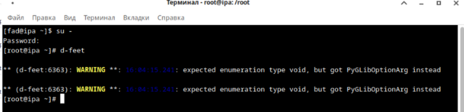

В окне d-feet в поисковике напиши alt ну до методов добираемся как на скрине

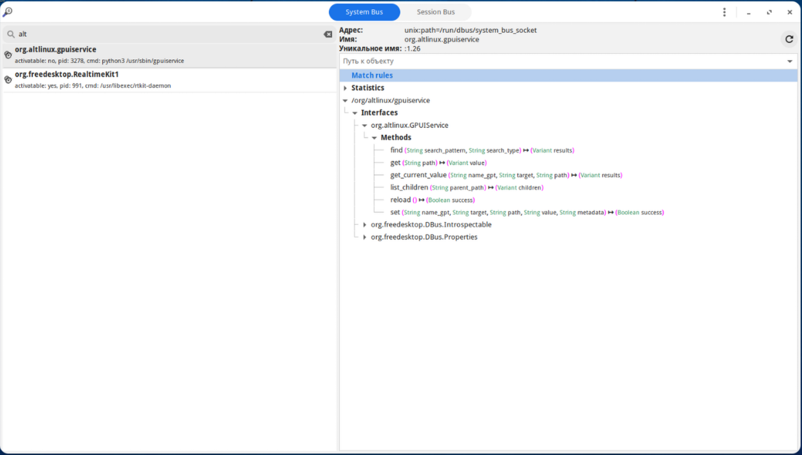

## list_children

Пройдемся по путям:

'Machine'

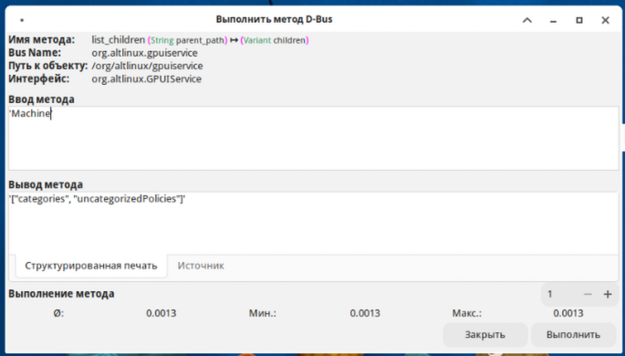

'Machine/categories'

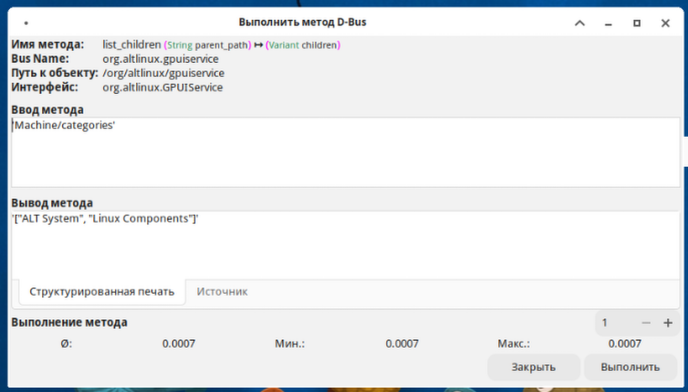

'Machine/categories/ALT System'

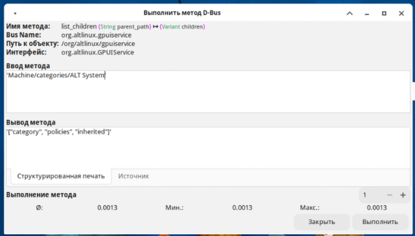

'Machine/categories/ALT System/inherited'

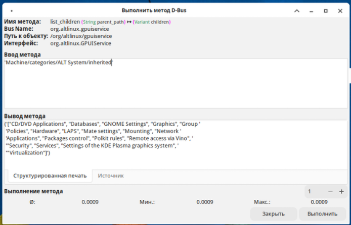

Выберем например категорию LAPS

'Machine/categories/ALT System/inherited/LAPS'

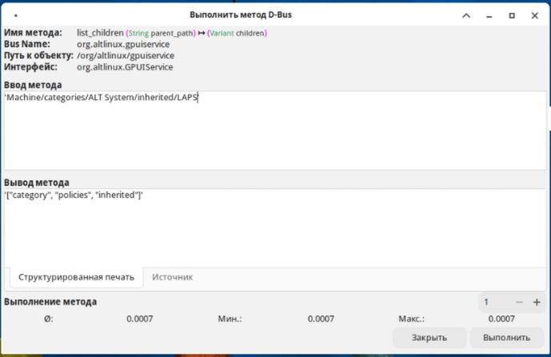

посмотрим политики

'Machine/categories/ALT System/inherited/LAPS/policies'

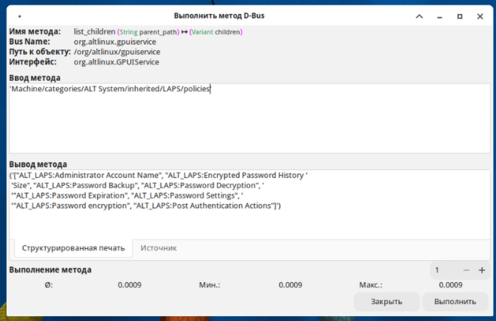

Выбираем первую политику ALT_LAPS:Administrator Account Name

обрати внимание, что что бы мы не вписали в list_children далее, в результате мы будем получать политики

'Machine/categories/ALT System/inherited/LAPS/policies/ALT_LAPS:Administrator Account Name'
изменений никаких нет, тоже самое, что и 'Machine/categories/ALT System/inherited/LAPS/policies'

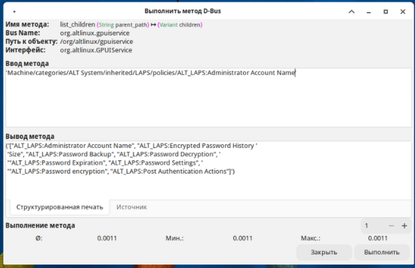

Или например введем 123, результат не изменится

'Machine/categories/ALT System/inherited/LAPS/policies/123'

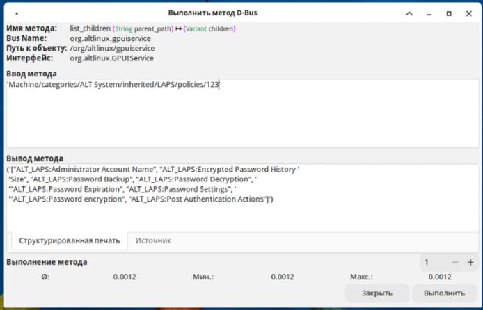

## Get Прочитаем значения

Прочитаем выбранную нами политику

'Machine/categories/ALT System/inherited/LAPS/policies/ALT_LAPS:Administrator Account Name'

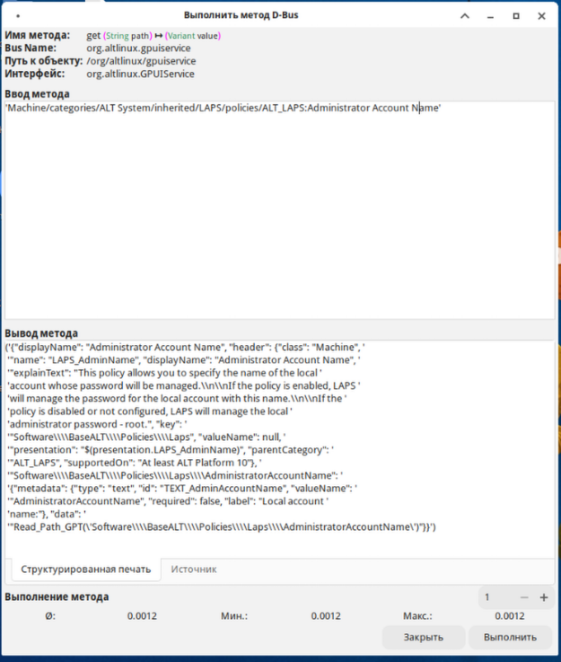

## Set Записываем

Произведем завись в 'Machine/categories/ALT System/inherited/LAPS/policies/ALT_LAPS:Administrator Account Name'

формат set(String name_gpt, String target, Strinf path, String value, String metadata)

**name_gpt** - это File System Path

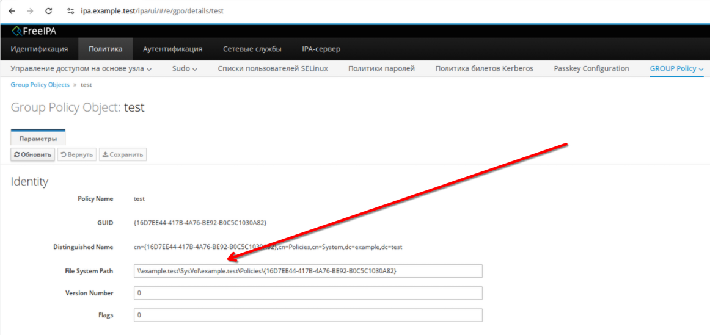

Обрати внимание, что нужно исправить на двойной слэш '//'

Добавляем name_gpt

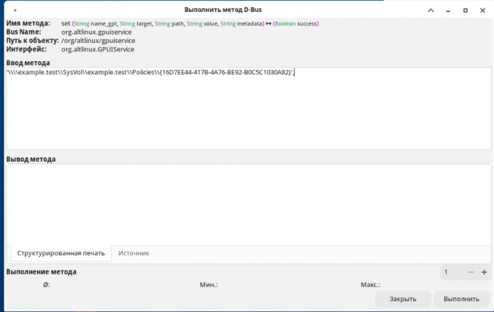

**target** - Machine или User

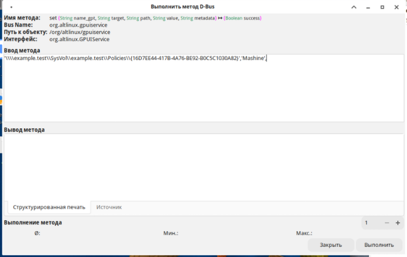

**path** - это значение Read_Path_GPT, которое мы получили с помощью get ранее

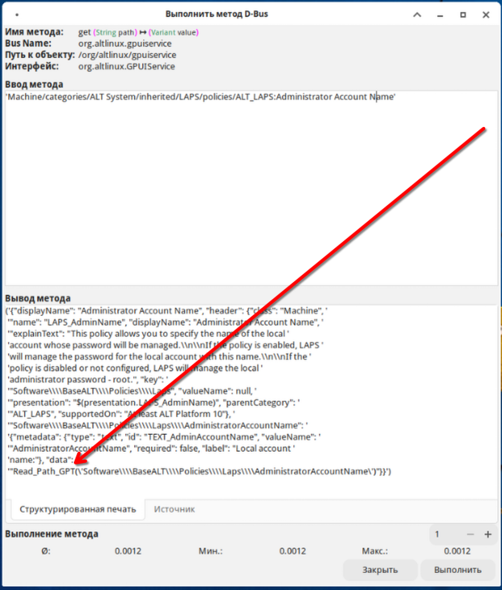

добавляем

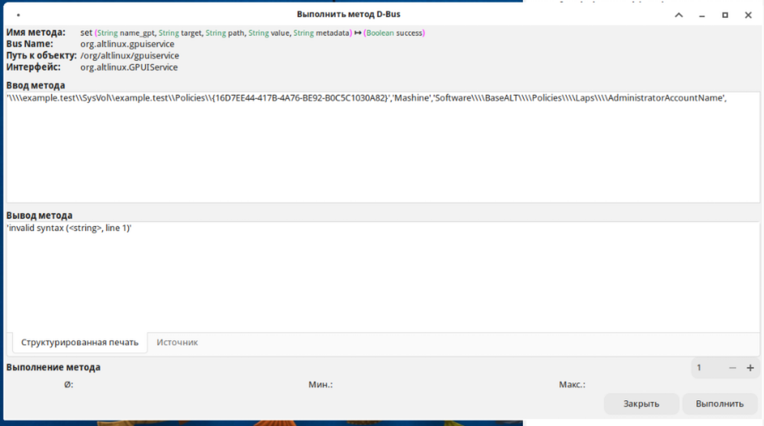

**value** - значение которое планируем передать

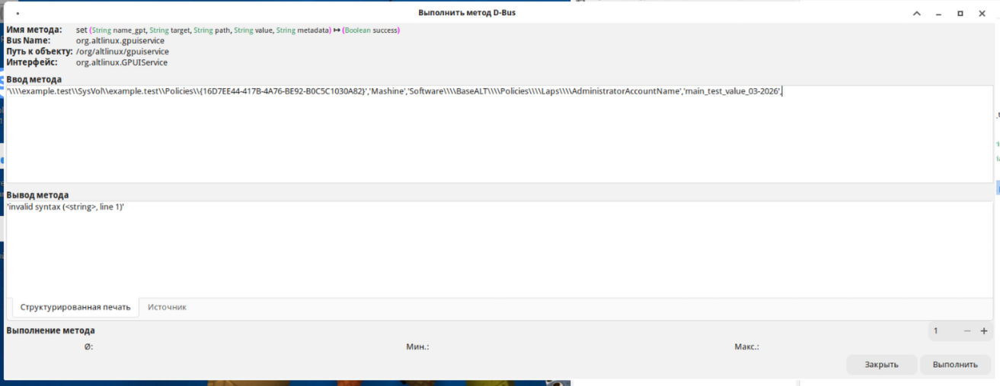

**metadata** - собствено путь политики для которой и производим запись
мы ранее выбрали 'Machine/categories/ALT System/inherited/LAPS/policies/ALT_LAPS:Administrator Account Name'

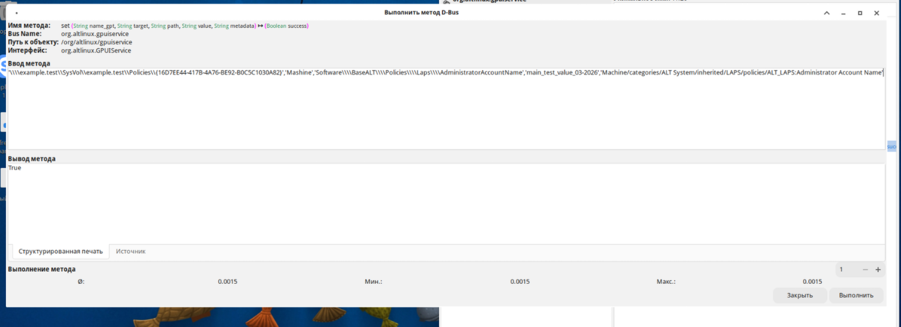

выполяем, если все хорошо, то получаем true.

## get_current_value Получаем наши записанные значения

формат set(String name_gpt, String target, Strinf path)

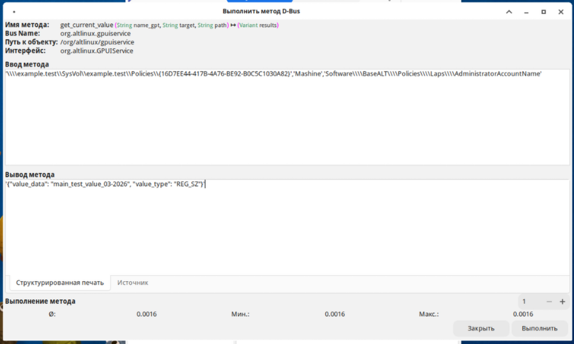

