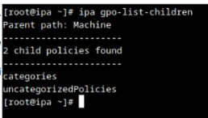
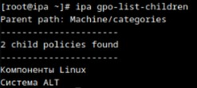
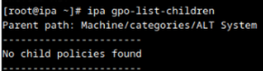
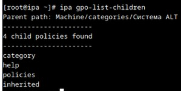
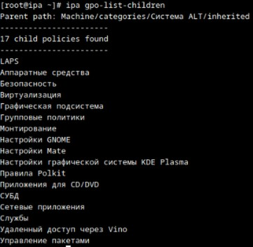
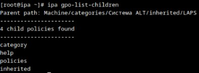
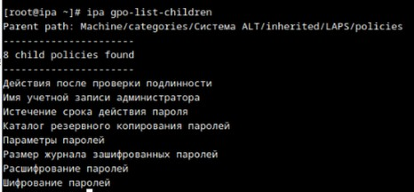
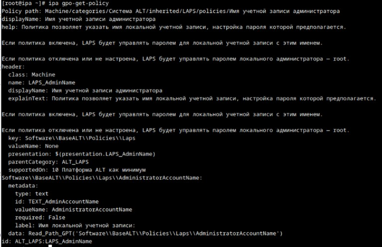

```
    kinit admin
```

## list_children 

```bash
ipa gpo-list-children
```

Machine



Machine/categories



Machine/categories/ALT System

!Обрати внимание, на то, что зависит от языка системы!



Machine/categories/Система ALT


Machine/categories/Система ALT/inherited


Machine/categories/Система ALT/inherited/LAPS


Machine/categories/Система ALT/inherited/LAPS/policies


Выбераем например: Имя учетной записи администратора

В результате мы получили следующий путь:

``` Machine/categories/Система ALT/inherited/LAPS/policies/Имя учетной записи администратора```


## Get Прочитаем значения

```bash
ipa gpo-get-policy
```



Данные path мы получаем из data

```data: Read_Path_GPT('Software\\BaseALT\\Policies\\Laps\\AdministratorAccountName')```

```path = Software\\BaseALT\\Policies\\Laps\\AdministratorAccountName```

## Set Записываем

В объекте политики нужно взять File System Path

в моем случаи https://ipa.example.test/ipa/ui/#/e/gpo/details/test
```
File System Path = \\example.test\SysVol\example.test\Policies\{16D7EE44-417B-4A76-BE92-B0C5C1030A82}
```

НАДО ДОПИСАТЬ!


## get_current_value

```bash
ipa gpo-get-current-value
```

```name_gpt = \\example.test\SysVol\example.test\Policies\{16D7EE44-417B-4A76-BE92-B0C5C1030A82}```
```target = Machine```
```path = Software\\BaseALT\\Policies\\Laps\\AdministratorAccountName```


