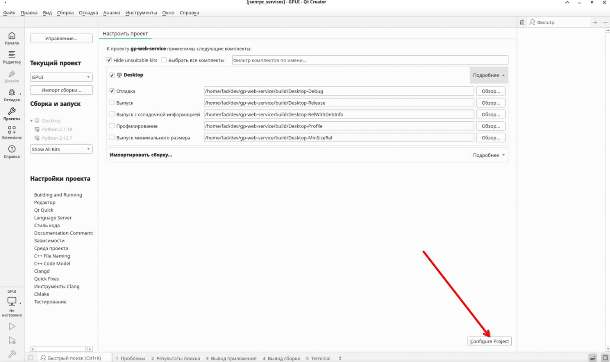
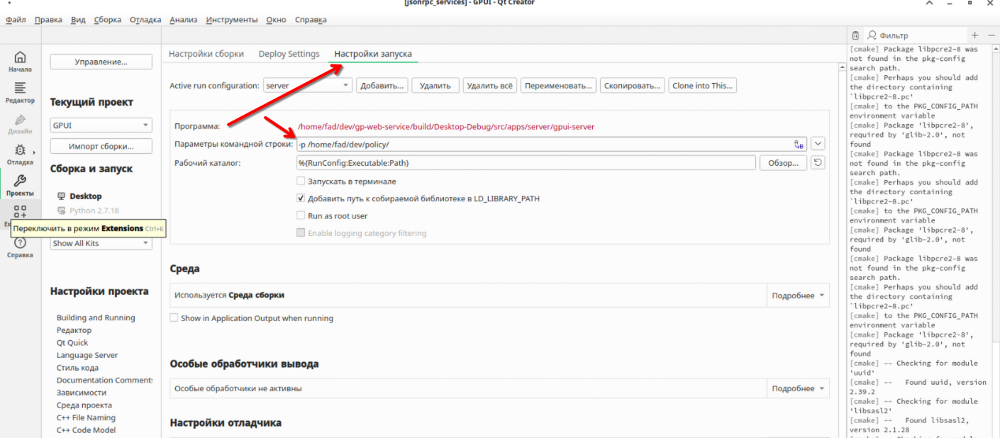
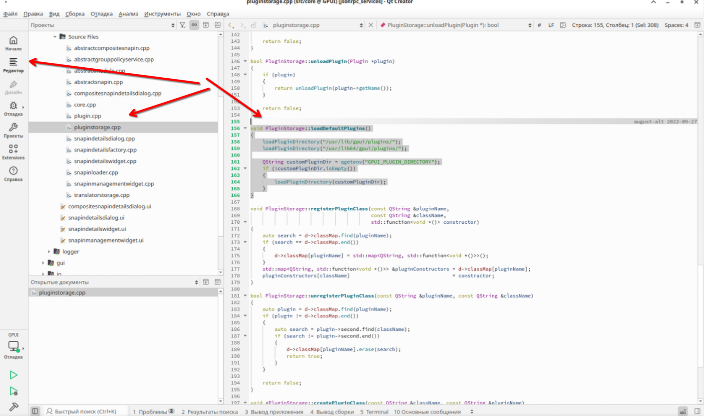
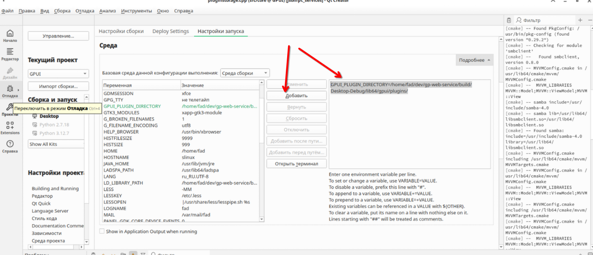
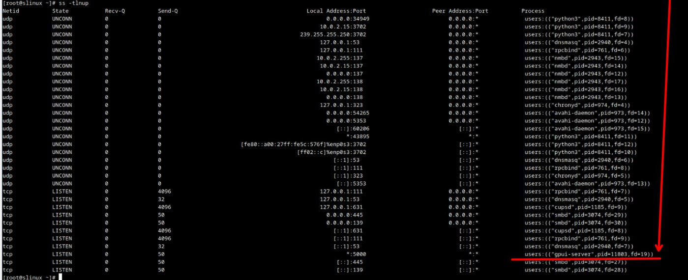

# prototype

>* [link github gp-web-service](https://github.com/august-alt/gp-web-service)
>* [link github gp-web-ui](https://github.com/august-alt/gp-web-ui)


## Установка

```bash 
apt-get install qt-creator
```

```bash
apt-get install cmake rpm-macros-cmake cmake-modules gcc-c++ qt5-base-devel qt5-declarative-devel qt5-tools-devel libsmbclient-devel libsmbclient samba-devel libldap-devel libsasl2-devel libsmbclient-devel libuuid-devel glib2-devel libpcre-devel libkrb5-devel libgtest-devel qt5-base-common doxygen libxerces-c-devel xsd boost-devel-headers qt5-networkauth-devel desktop-file-utils ImageMagick-tools libqt-mvvm-devel xorg-xvfb xvfb-run
```

Так же нужно установить ```libqjsonrp``` данная библиотека, есть только в sisyphus. У нас есть два варианта установить из sisyphus или собрать самим.

## Сборка libqjsonrpc

[Домашняя страница github - qjsonrpc](https://github.com/august-alt/qjsonrpc)


```bash
git clone https://github.com/august-alt/qjsonrpc
```

Установим зависимость ```libhttp-parser-devel```

```bash
apt-get install libhttp-parser-devel
```

```bash
gear-rpm -ba
```

```
Wrote: /home/fad/RPM/SRPMS/libqjsonrpc-1.0.0-alt1.src.rpm (w2.lzdio)
Wrote: /home/fad/RPM/RPMS/x86_64/libqjsonrpc-1.0.0-alt1.x86_64.rpm (w2.lzdio)
Wrote: /home/fad/RPM/RPMS/x86_64/libqjsonrpc-devel-1.0.0-alt1.x86_64.rpm (w2.lzdio)
Wrote: /home/fad/RPM/RPMS/x86_64/libqjsonrpc-debuginfo-1.0.0-alt1.x86_64.rpm (w2.lzdio)
```

```bash
[root@ipa log] apt-get install /home/fad/RPM/RPMS/x86_64/libqjsonrpc-1.0.0-alt1.x86_64.rpm /home/fad/RPM/RPMS/x86_64/libqjsonrpc-devel-1.0.0-alt1.x86_64.rpm

[root@ipa log] apt-get install /home/fad/RPM/RPMS/x86_64/libqjsonrpc-1.0.0-alt1.x86_64.rpm /home/fad/RPM/RPMS/x86_64/libqjsonrpc-devel-1.0.0-alt1.x86_64.rpm
```

## Настройка и запуск gp web service

Запускаем QT Creator, выбираем проект  

открывем проект Open Project...

```/home/fad/dev/gp-web-service/CMakeLists.txt```



Создадим папку ```policy```, в моем случаи ```/home/fad/dev/policy/```

Пропишем параметры командной строки ```-p /home/fad/dev/policy/```



Уточняем где должны храниться наши плагины

```
    loadPluginDirectory("/usr/lib/gpui/plugins/");
    loadPluginDirectory("/usr/lib64/gpui/plugins/");
```



Добавляем в среду плагины



```GPUI_PLUGIN_DIRECTORY=/home/localadmin/git/gp-web-service/build/Desktop-Debug/lib64/gpui/plugins/```

Собираем и запускаем! Должно собраться и сервер должен запуститься.

Что бы проверить, что сервер работает поможет команда ```ss -tlnup```



Обращаю внимание, что сервер работает на ```:5000``` порту.


