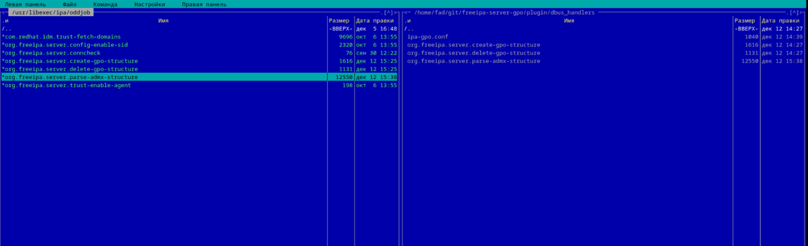

ipa-gpo-install


Команда ipactl restart перезапускает службы контроллера домена. 


# rpm -ql freeipa-server-gpo

```bash
[root@ipa ~]# rpm -ql freeipa-server-gpo
/etc/oddjobd.conf.d/ipa-gpo.conf
/usr/bin/ipa-gpo-install
/usr/lib64/python3/site-packages/ipa_gpo_install
/usr/lib64/python3/site-packages/ipa_gpo_install/__init__.py
/usr/lib64/python3/site-packages/ipa_gpo_install/__pycache__
/usr/lib64/python3/site-packages/ipa_gpo_install/__pycache__/__init__.cpython-312.opt-1.pyc
/usr/lib64/python3/site-packages/ipa_gpo_install/__pycache__/__init__.cpython-312.opt-2.pyc
/usr/lib64/python3/site-packages/ipa_gpo_install/__pycache__/__init__.cpython-312.pyc
/usr/lib64/python3/site-packages/ipa_gpo_install/__pycache__/actions.cpython-312.opt-1.pyc
/usr/lib64/python3/site-packages/ipa_gpo_install/__pycache__/actions.cpython-312.opt-2.pyc
/usr/lib64/python3/site-packages/ipa_gpo_install/__pycache__/actions.cpython-312.pyc
/usr/lib64/python3/site-packages/ipa_gpo_install/__pycache__/checks.cpython-312.opt-1.pyc
/usr/lib64/python3/site-packages/ipa_gpo_install/__pycache__/checks.cpython-312.opt-2.pyc
/usr/lib64/python3/site-packages/ipa_gpo_install/__pycache__/checks.cpython-312.pyc
/usr/lib64/python3/site-packages/ipa_gpo_install/__pycache__/cli.cpython-312.opt-1.pyc
/usr/lib64/python3/site-packages/ipa_gpo_install/__pycache__/cli.cpython-312.opt-2.pyc
/usr/lib64/python3/site-packages/ipa_gpo_install/__pycache__/cli.cpython-312.pyc
/usr/lib64/python3/site-packages/ipa_gpo_install/__pycache__/config.cpython-312.opt-1.pyc
/usr/lib64/python3/site-packages/ipa_gpo_install/__pycache__/config.cpython-312.opt-2.pyc
/usr/lib64/python3/site-packages/ipa_gpo_install/__pycache__/config.cpython-312.pyc
/usr/lib64/python3/site-packages/ipa_gpo_install/actions.py
/usr/lib64/python3/site-packages/ipa_gpo_install/checks.py
/usr/lib64/python3/site-packages/ipa_gpo_install/cli.py
/usr/lib64/python3/site-packages/ipa_gpo_install/config.py
/usr/lib64/python3/site-packages/ipaserver/plugins/__pycache__/chain.cpython-312.opt-1.pyc
/usr/lib64/python3/site-packages/ipaserver/plugins/__pycache__/chain.cpython-312.opt-2.pyc
/usr/lib64/python3/site-packages/ipaserver/plugins/__pycache__/chain.cpython-312.pyc
/usr/lib64/python3/site-packages/ipaserver/plugins/__pycache__/gpmaster.cpython-312.opt-1.pyc
/usr/lib64/python3/site-packages/ipaserver/plugins/__pycache__/gpmaster.cpython-312.opt-2.pyc
/usr/lib64/python3/site-packages/ipaserver/plugins/__pycache__/gpmaster.cpython-312.pyc
/usr/lib64/python3/site-packages/ipaserver/plugins/__pycache__/gpo.cpython-312.opt-1.pyc
/usr/lib64/python3/site-packages/ipaserver/plugins/__pycache__/gpo.cpython-312.opt-2.pyc
/usr/lib64/python3/site-packages/ipaserver/plugins/__pycache__/gpo.cpython-312.pyc
/usr/lib64/python3/site-packages/ipaserver/plugins/chain.py
/usr/lib64/python3/site-packages/ipaserver/plugins/gpmaster.py
/usr/lib64/python3/site-packages/ipaserver/plugins/gpo.py
/usr/libexec/ipa/oddjob/org.freeipa.server.create-gpo-structure
/usr/libexec/ipa/oddjob/org.freeipa.server.delete-gpo-structure
/usr/share/bash-completion/completions/ipa-gpo-install
/usr/share/doc/freeipa-server-gpo-0.0.2
/usr/share/doc/freeipa-server-gpo-0.0.2/README.md
/usr/share/doc/freeipa-server-gpo-0.0.2/README.ru.md
/usr/share/ipa/schema.d/75-chain.ldif
/usr/share/ipa/schema.d/75-gpc.ldif
/usr/share/ipa/schema.d/75-gpmaster.ldif
/usr/share/ipa/ui/js/plugins/chain/chain.js
/usr/share/ipa/ui/js/plugins/chain/gpo.js
/usr/share/ipa/updates/75-chain.update
/usr/share/ipa/updates/75-gpc.update
/usr/share/ipa/updates/75-gpmaster.update
/usr/share/locale/ru/LC_MESSAGES/ipa-gpo-install.mo
/usr/share/man/man8/ipa-gpo-install.8.xz
/usr/share/man/ru/man8/ipa-gpo-install.8.xz

```


Мне нужно

/usr/lib64/python3/site-packages/ipaserver/plugins/chain.py
/usr/lib64/python3/site-packages/ipaserver/plugins/gpmaster.py
/usr/lib64/python3/site-packages/ipaserver/plugins/gpo.py

и
/usr/share/ipa/ui/js/plugins/chain/chain.js
/usr/share/ipa/ui/js/plugins/chain/gpo.jsм


Запуск vscode

code --no-sandbox --user-data-dir=/root/.vscode-root


Создание своей js

/usr/share/ipa/ui/js/plugins/  создаем папку например gp_main и в ней gp_main.js
прописывать пути ненадо само подтянится.


# Разные ссылки 

* https://github.com/freeipa/freeipa-webui?tab=readme-ov-file
* https://www.patternfly.org/
* https://www.figma.com/community/file/1357062621908564852/patternfly-6-patterns-extensions
* https://github.com/danila-Skachedubov/freeipa-server-gpo/tree/master/plugin/ui/grouppolicy
* https://github.com/abbra


# Разное

* https://github.com/danila-Skachedubov/freeipa-server-gpo/tree/dev

```bash
apt-get install admx-basealt
```

```bash
systemctl restart oddjobd.service
```

```bash
 ipactl restart
 ```

* https://github.com/danila-Skachedubov/freeipa-server-gpo/tree/dev

еще нужно перенести файлфде


 

 дать права на исполнение

 ```bash
 chmod +x org.freeipa.server.parse-admx-structure 
 ```


 ```bash
 [fad@ipa freeipa-server-gpo]$ gear-rpm -ba --commit
 ```

 